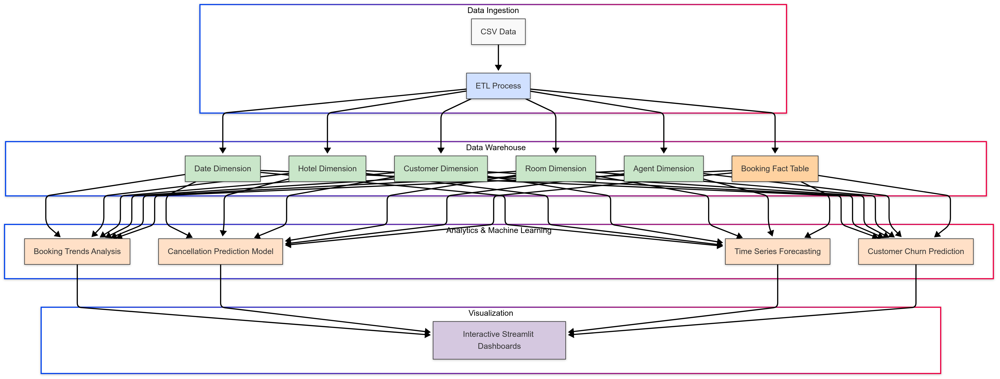
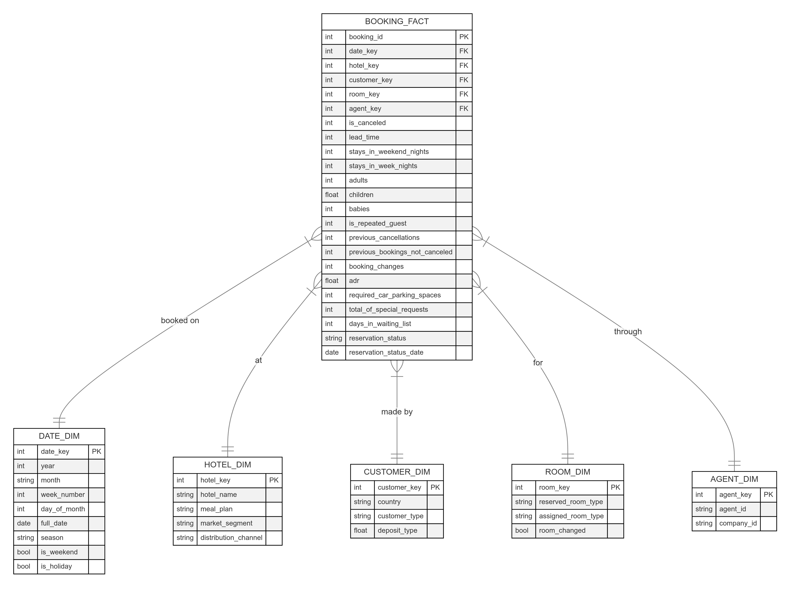

# Hotel Booking Analytics - Data Engineering & Analytics Solution

This repository contains a comprehensive data engineering and analytics pipeline for hotel booking data, including data warehousing, interactive dashboards, and machine learning models.

## Overview

This solution analyzes hotel booking data to provide insights into booking patterns, cancellations, revenue optimization, and customer behavior. The pipeline includes:

1. **Data Ingestion & Transformation**: ETL process to extract raw data, transform it into a star schema, and load it into a data warehouse.
2. **Data Modeling**: Star schema design with dimension and fact tables for efficient querying.
3. **Machine Learning Models**:
   - Cancellation prediction model to identify bookings at risk
   - Time series forecasting for future booking demand
   - Customer churn prediction to identify guests unlikely to return
4. **Interactive Dashboard**: Streamlit-based visual analytics across multiple domains

## Architecture

The solution follows a layered architecture:



### Data Warehouse Schema (Star Schema)

The data is modeled as a star schema with the following tables:



- **Fact Table**: booking_fact
- **Dimension Tables**: date_dim, hotel_dim, customer_dim, room_dim, agent_dim

## Components

### 1. ETL Pipeline

The ETL process (`etl-script.py`) handles:
- Data extraction from CSV 
- Data transformation into the star schema
- Data loading into SQLite database
- Creation of indexes for query optimization

Main functions:
- `extract_data()`: Loads the raw CSV file
- `transform_data()`: Creates dimension and fact tables
- `load_data()`: Populates the database
- `create_indexes()`: Creates database indexes

### 2. Predictive Models

#### Cancellation Prediction Model

The cancellation model (`cancellation-prediction.py`) predicts which bookings are likely to be canceled:
- Random Forest classifier
- Features include lead time, room type, market segment, etc.
- Cross-validation with grid search for hyperparameter tuning
- Feature importance analysis to identify key cancellation factors

#### Booking Demand Forecasting

The forecasting model (`forecasting-model.py`) predicts future booking demand:
- SARIMA time series forecasting
- Captures seasonal patterns, trends, and month-to-month variations
- Includes confidence intervals for uncertainty estimation
- Enables capacity planning and revenue optimization

#### Customer Churn Prediction

The churn prediction model (`churn-prediction.py`) identifies guests at risk of not returning:
- Gradient Boosting classifier
- Creates churn labels based on return patterns and booking behavior
- Segments customers by value and churn risk
- Provides tailored retention recommendations

### 3. Interactive Dashboard

The dashboard (`analytics-dashboard.py`) provides:
- Booking trends analysis and visualization
- Cancellation analytics and risk factors
- Revenue insights and optimization opportunities
- Predictive analytics for cancellation and churn
- Strategic recommendations for management

Main tabs:
- Booking Trends
- Cancellation Analytics
- Revenue Insights
- Predictive Analytics
- Recommendations

## Installation & Usage

### Prerequisites

- Python 3.8+
- Required packages: pandas, numpy, scikit-learn, statsmodels, streamlit, plotly, matplotlib, seaborn, sqlite3, joblib

### Setup

1. Clone the repository:
```
git clone https://github.com/yourusername/hotel-analytics.git
cd hotel-analytics
```

2. Install dependencies:
```
pip install -r requirements.txt
```

3. Run the ETL process to create the data warehouse:
```
python etl-script.py
```

4. Train the prediction models:
```
python cancellation-prediction.py
python forecasting-model.py
python churn-prediction.py
```

5. Launch the dashboard:
```
streamlit run analytics-dashboard-full.py
```

## Results and Insights

The analysis revealed several key insights:

1. **Booking Patterns**:
   - Seasonal variations with peak bookings in summer months
   - Lead time significantly impacts cancellation rates
   - Most bookings are for short stays (1-3 nights)

2. **Cancellation Factors**:
   - Lead time is the strongest predictor of cancellations
   - Deposit type strongly influences cancellation behavior
   - Special requests correlate with lower cancellation rates

3. **Revenue Optimization**:
   - Room types vary significantly in profitability
   - Certain market segments generate higher ADR
   - Seasonal pricing opportunities exist

4. **Customer Retention**:
   - Repeat guests spend more on average
   - High-value guests have specific retention factors
   - Churn predictors include room changes and special requests

## Future Enhancements

Potential improvements for future iterations:

1. **Real-time Data Pipeline**: Implement streaming data ingestion for real-time analytics
2. **Advanced Forecasting**: Incorporate external factors like events, holidays, weather
3. **Recommendation Engine**: Personalized offers based on guest profiles and preferences
4. **A/B Testing Framework**: Test different pricing and marketing strategies
5. **Integration with Hotel PMS**: Direct connection to property management systems

## Author

gibranhasan14@gmail.com

## License

This project is licensed under the MIT License - see the LICENSE file for details.
